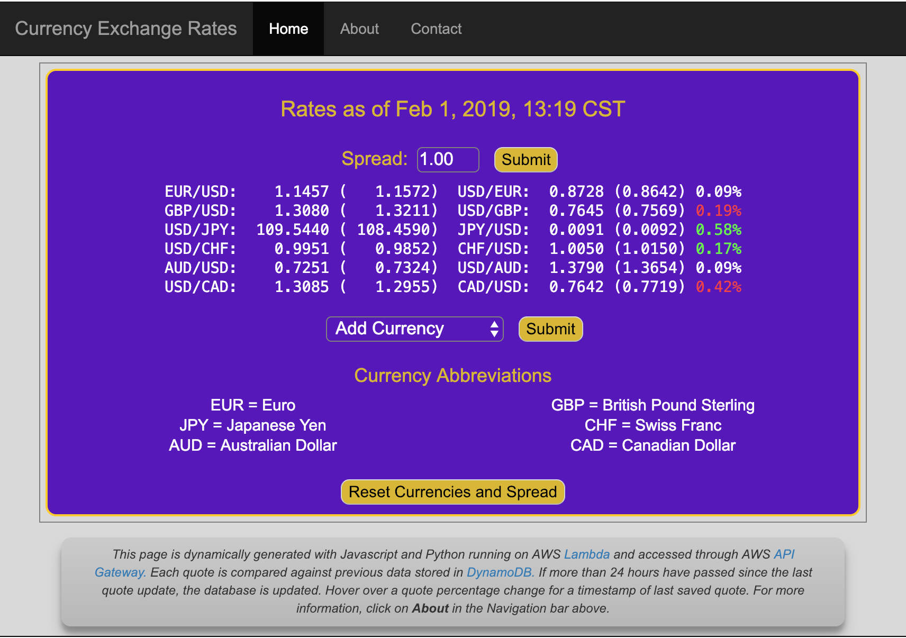

# Currency Monitoring Project

Currency Monitor provides an easy way to monitor a basket of foreign currencies.
Using the Currency Layer Web Service, the program queries the service for the
latest quotations relative to the US dollar (USD) and displays results. Using the
free tier, price quotes are guaranteed to be no more than 60 minutes old.
More frequent updates are available at higher price tiers.

The initial or default basket of currencies is configurable and up to 168
currencies can be added.

I've implemented both command line and AWS lambda versions of the program.

- exchange.py is the command line version which displays updates once per hour
   to the console (terminal). Program also provides a progress bar showing when
   the next update will occur based on timestamp provided by the service.

- lambda.py is a simplified version for AWS lambda that runs once and returns
  results as a formatted Web page. Program uses HTML, CSS and Javascript. Since
  there is no persistent data store used, this version can only display the most
  recent quotes with no knowledge of how prices have changed over time.

- currency_lambda.py is an AWS Lambda version which uses AWS DynamoDB service
  to hold previous currency quote results and timestamps which are compared
  with current quotes to determine if the dollar has strengthened or weakened.
  When the function executes, if more than 24 hours have elapsed since last database update, the database quote and timestamps are then updated with
  most current data from Currency Layer service. You can view the latest version
  by visiting: https://api.mikeoc.me/service/beta/getExchangeRates

- init_dynamo_table.py is used to initialize the DynamoDB table with Abbreviations,
  Current Rates and Timestamp for each supported Currency. Run this once after
  table is created typically using the AWS console or AWS CLI. This can also be
  used at any time to re-establish a baseline for change comparisons.

- currency_config.py contains various configuration definitions along with
  currency abbreviations and their associated descriptions. This file is
  only used with the Lambda versions and also references other CSS and HTML files
  stored remotely on S3 Object storage which are loaded at runtime. Copies of
  these additional files are located in the S3 directory.

- The S3 directory contains several HTML, CSS and Javascript files that are
  linked from or read by currency_lambda.py. These files should be hosted
  on AWS S3 or similar Object storage. URL path to each resource is defined in
  the currency_config.py configuration file.

## Dependencies:

Command line version requires that CL_KEY environment variable be set prior to
execution. The lambda version expects the key and other variables to be defined
in currency_config.py.

To obtain a CL key and review pricing options visit: https://currencylayer.com

The currency_lambda.py version expects to have an AWS DynamoDB database defined
which it uses to store the most recent currency exchange rates.

init_dynamo_table.py expects to find AWS_SECRET_ACCESS_KEY and AWS_ACCESS_KEY_ID
defined in the users shell environment. See AWS IAM for more information.

## Technologies Used

- AWS Lambda, DynamoDB, S3 and API Gateway
- Python 3 with Boto3 module
- HTML, CSS, Javascript and Bootstrap (For Navbar)
- Currency Layer Currency Exchange Rate Quote service
